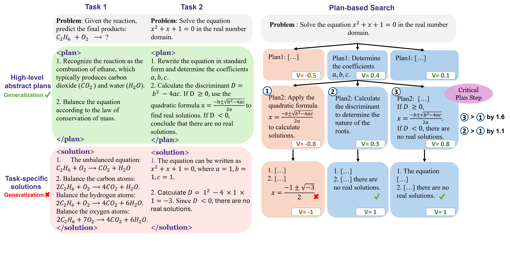
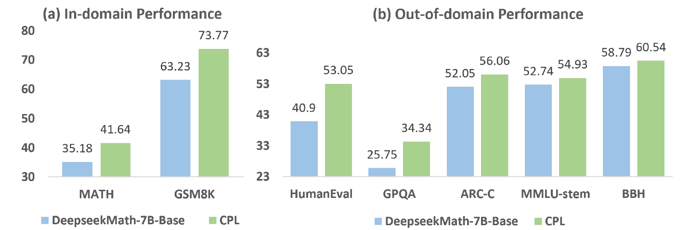

# CPL: Critical Plan Step Learning Boosts LLM Generalization in Reasoning Tasks




## **Environment Setup**
Create a Python virtual environment and install the dependencies:

```bash
conda create -n cpl python=3.10 -y
conda activate cpl
pip install -r requirements.txt
```

We use our customized version of LLaMA-Factory, based on [LLaMA-Factory-0.8.3](https://github.com/hiyouga/LLaMA-Factory/releases/tag/v0.8.3), as our training framework. Install it using the command:
```bash
cd apo/LLaMA-Factory-0.8.3 && pip install -e ".[torch,metrics]" && cd ../..
```

We use the [math evaluation toolkit](https://github.com/MARIO-Math-Reasoning/MARIO_EVAL) to assess the accuracy of the predicted answers. Follow their installation steps:

```bash
git clone https://github.com/MARIO-Math-Reasoning/MARIO_EVAL.git
cd MARIO_EVAL
cd latex2sympy && pip install . && cd ..
pip install -e . && cd ..
```

We also use Flash Attention 2. Install it using the following command:
```bash
pip install flash-attn --no-build-isolation
```

## **Training**
### Round 1
First, we need to initialize the policy model and value model:
```bash
huggingface-cli login
python mcts_plan/init_models.py
```

#### Plan-based MCTS
```bash
# Deploy the local Policy model as a server using vllm
# The api-key should be filled with the string "api-key" (not an actual key).
CUDA_VISIBLE_DEVICES=0,1,2,3 vllm serve models/policy_model_round1 \
    --host 0.0.0.0 \
    --port 8000 \
    --api-key api-key \
    --tensor-parallel-size 4 \
    --trust-remote-code \
    --seed 1234 \
    --swap-space 16 \
    --served-model-name policy_model

# Execute the plan-based MCTS.
CUDA_VISIBLE_DEVICES=4,5,6,7 python mcts_plan/solve.py \
    --custom_cfg mcts_plan/configs/mcts_round1.yaml \
    --qaf mcts_plan/data/5k.json
```

**Note**: The code we actually used for the Round 1 Plan-based MCTS is based on [AlphaMath](https://github.com/MARIO-Math-Reasoning/Super_MARIO) and utilizes their [customized vllm](https://github.com/MARIO-Math-Reasoning/vllm). The above code is our integrated version that supports both Round 1 and Round 2. You can use this code for the Round 1 Plan-based MCTS, but there may be slight differences in the results.

#### Generate SFT and Step-APO data
```bash
python gen_data/gen_policy_model_round1_sft_data.py  
python gen_data/gen_policy_model_round1_apo_data.py  
python gen_data/gen_value_model_round1_sft_data.py
```
#### Optimize the policy model
```bash
cd apo/LLaMA-Factory-0.8.3
llamafactory-cli train my_scripts/policy_model_round1_sft.yaml
llamafactory-cli train my_scripts/policy_model_round1_apo.yaml
cd ../..
```

#### Optimize the value model
```bash
cd sft_value_head
accelerate launch --config_file "accelerate_configs/deepspeed_zero3.yaml" \
run_sft.py \
    --model_name_or_path "deepseek-ai/deepseek-math-7b-base" \
    --data_path "data/value_model_round1_sft_data.json" \
    --cutoff_len 1024 \
    --preprocessing_num_workers 24 \
    --output_dir "../models/value_model_round1_sft" \
    --logging_step 1 \
    --save_strategy "epoch" \
    --save_total_limit 3 \
    --overwrite_output_dir True \
    --per_device_train_batch_size 8 \
    --gradient_accumulation_steps 16 \
    --learning_rate "1e-5" \
    --lr_scheduler_type "cosine" \
    --num_train_epochs 7.0 \
    --warmup_ratio 0.1 \
    --bf16 True \
    --gradient_checkpointing True \
    --eval_strategy "steps" \
    --per_device_eval_batch_size 1 \
    --eval_steps 20 \
    --remove_unused_columns False \
    --report_to "wandb" \
    --run_name "value_model_round1_sft"

# postprocess for Round 2
python postprocess_value_model.py
cd ..
```

### Round 2
#### Plan-based MCTS
```bash
# Deploy the local Policy model as a server using vllm
# The api-key should be filled with the string "api-key" (not an actual key).
CUDA_VISIBLE_DEVICES=0,1,2,3 vllm serve models/policy_model_round2 \
    --host 0.0.0.0 \
    --port 8000 \
    --api-key api-key \
    --tensor-parallel-size 4 \
    --trust-remote-code \
    --seed 1234 \
    --swap-space 16 \
    --served-model-name policy_model

# Execute the plan-based MCTS.
CUDA_VISIBLE_DEVICES=4,5,6,7 python mcts_plan/solve.py \
    --custom_cfg mcts_plan/configs/mcts_round2.yaml \
    --qaf mcts_plan/data/15k.json
```


#### Generate SFT and Step-APO data
```bash
python gen_data/gen_policy_model_round2_sft_data.py  
python gen_data/gen_policy_model_round2_apo_data.py  
```

#### Optimize the policy model
```bash
cd apo/LLaMA-Factory-0.8.3
llamafactory-cli train my_scripts/policy_model_round2_sft.yaml
llamafactory-cli train my_scripts/policy_model_round2_apo.yaml
cd ../..
```

## **Citation**

If you find our work helpful, please kindly cite our paper:

```
@misc{wang2024cplcriticalplanstep,
      title={CPL: Critical Plan Step Learning Boosts LLM Generalization in Reasoning Tasks}, 
      author={Tianlong Wang and Junzhe Chen and Xueting Han and Jing Bai},
      year={2024},
      eprint={2409.08642},
      archivePrefix={arXiv},
      primaryClass={cs.AI},
      url={https://arxiv.org/abs/2409.08642}, 
}
```


